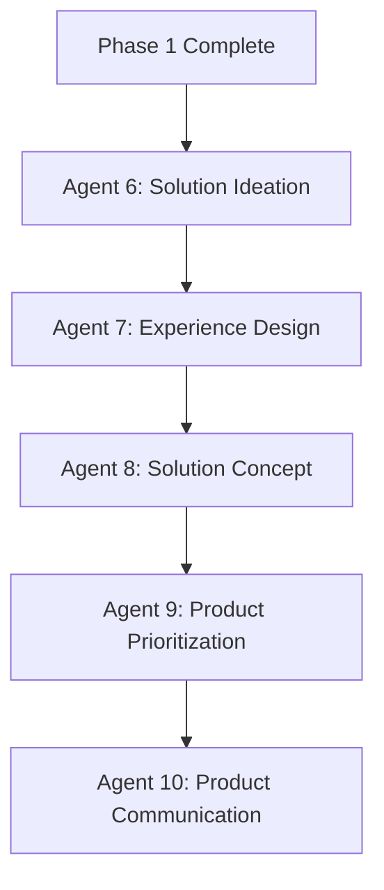

# Solution Space Agents (Phase 2)

**Version:** 2.0.0  
**Last Updated:** 2025-10-15  
**Focus:** Digital Products, Services, and Experience Improvements

---

## Overview

The Solution Space consists of 5 specialized agents (Agents 6-10) that systematically transform problem analysis into actionable product/service concepts, prioritized roadmaps, and stakeholder communications. This phase focuses on **experience design, product ideation, and strategic communication** rather than process automation or AI implementation.

---

## Agent Sequence & Responsibilities

### 🎯 Agent 6: Solution Ideation Specialist
**Input:** Phase 1 outputs (pain reports, journey, problem statement)  
**Output:** Strategic opportunities, prioritization matrix, roadmap  
**Purpose:** Transform pain points into product/service/experience opportunities

**Key Tasks:**
- Analyze pain point clusters and user needs
- Create product/service/experience opportunities
- Prioritize using RICE + User Impact framework
- Create strategic roadmap with quick wins

### 🎨 Agent 7: Experience Design Specialist
**Input:** Agent 6 outputs (opportunities, priorities)  
**Output:** Future journey (To-Be), experience improvements  
**Purpose:** Design improved future experience

**Key Tasks:**
- Design consolidated future journey (To-Be state)
- Map experience improvements to journey stages
- Define value moments and UX quality targets
- Document transformation (As-Is → To-Be)

### 💡 Agent 8: Solution Concept Specialist
**Input:** Agent 6 + 7 outputs (opportunities, future journey)  
**Output:** Solution concepts, feasibility assessment  
**Purpose:** Detail conceptual solutions with feasibility analysis

**Key Tasks:**
- Detail solution concepts (features, capabilities, benefits)
- Assess feasibility (technical, business, desirability)
- Create concept-level specifications (NOT technical specs)
- Provide recommendations based on feasibility

**Important:** Focus on **conceptual solutions**, not detailed technical implementation.

### 🎯 Agent 9: Product Prioritization Specialist
**Input:** Agent 8 outputs (solution concepts, feasibility)  
**Output:** MVP scope, feature prioritization, validation plan  
**Purpose:** Ruthlessly prioritize for MVP and create validation approach

**Key Tasks:**
- Define MVP scope (core value proposition)
- Prioritize features using Impact vs Effort Matrix
- Create validation plan (hypotheses, metrics)
- Plan post-MVP roadmap (Stage 2)

### 📢 Agent 10: Product Communication Specialist
**Input:** All previous agents' outputs  
**Output:** Product brief, roadmap, executive materials  
**Purpose:** Create stakeholder communications and executive materials

**Key Tasks:**
- Create comprehensive product brief
- Design visual product roadmap
- Document experience evolution
- Develop stakeholder communication plans
- Prepare executive presentation

---

## Workflow Dependencies



---

## File Structure Created

```
2-solution/
├── 2a-opportunities/
│   ├── opportunities-identification.md
│   ├── prioritization-matrix.md
│   ├── strategic-roadmap.md
│   └── 2a1-opportunities-breakdown/
│       ├── (opportunity1).md
│       ├── (opportunity2).md
│       └── ...
├── 2b-tobe_journey/
│   ├── consolidated-future-journey.md
│   ├── experience-improvements.md
│   └── 2b1-journey-breakdown/
│       ├── (stage1)-future.md
│       ├── (stage2)-future.md
│       └── ...
├── 2c-priotization/
│   ├── solution-concepts.md
│   ├── feasibility-assessment.md
│   └── 2c1-concept-breakdown/
│       ├── (concept1).md
│       ├── (concept2).md
│       └── ...
├── 2d-roadmap/
│   ├── mvp-scope.md
│   ├── feature-prioritization.md
│   ├── validation-plan.md
│   ├── 2d1-mvp/
│   │   ├── (feature1).md
│   │   ├── (feature2).md
│   │   └── ...
│   └── 2d2-stage2/
│       ├── (feature1).md
│       ├── (feature2).md
│       └── ...
└── 2e-solution-output/
    ├── product-brief.md
    ├── product-roadmap.md
    ├── experience-evolution.md
    ├── executive-presentation.md
    ├── success-metrics-dashboard.md
    └── stakeholder-communications/
        ├── (audience1).md
        ├── (audience2).md
        └── ...
```

---

## Templates & Dependencies

### Required Templates
- `_output-structure/solution-space/opportunity-identification-template.md`
- `_output-structure/solution-space/opportunity-breakdown-template.md`
- `_output-structure/solution-space/prioritization-matrix-template.md`
- `_output-structure/solution-space/strategic-roadmap-template.md`
- `_output-structure/solution-space/future-journey-template.md`
- `_output-structure/solution-space/future-journey-breakdown-template.md`
- `_output-structure/solution-space/experience-improvements-template.md`
- `_output-structure/solution-space/solution-concept-template.md`
- `_output-structure/solution-space/concept-breakdown-template.md`
- `_output-structure/solution-space/feasibility-assessment-template.md`
- `_output-structure/solution-space/mvp-scope-template.md`
- `_output-structure/solution-space/feature-prioritization-template.md`
- `_output-structure/solution-space/validation-plan-template.md`
- `_output-structure/solution-space/product-brief-template.md`
- `_output-structure/solution-space/product-roadmap-template.md`
- `_output-structure/solution-space/experience-evolution-template.md`

### Supporting Files
- `_output-structure/problem-space/model-structure.md`
- `_output-structure/workflow-rules.md`

---

## Usage Instructions

### 1. Prerequisites
Ensure the following exist before starting:
- Complete Phase 1 outputs in `/1-problem/1d-problem-output/`
- Consolidated journey in `/1-problem/1c-asis-journey/asis-journey.md`
- Pain point mapping in `/1-problem/1b-painpoints/painpoint-mapping.md`
- All required template files in `_output-structure/solution-space/`

### 2. Execution Modes
- **End-to-End:** Sequential execution without interruption
- **Step-by-Step:** Agent-by-agent with approval gates

### 3. Trigger Commands
```
start workflow
begin solution phase
continue to phase 2
start solution design
```

### 4. Quality Gates
- **Agent 8 → Agent 9:** Validate concepts are conceptual, not technical specs
- **Agent 9 → Agent 10:** Validate MVP scope is ruthlessly prioritized
- **Phase 2 → Implementation:** Mandatory checkpoint for stakeholder alignment

---

## Output Quality Standards

### Data Integrity Requirements
- ✅ **Source Attribution:** All solutions traceable to pain points and user needs
- ✅ **Conservative Language:** No invented metrics or unsubstantiated claims
- ✅ **Evidence-Based:** All concepts address specific documented pain points
- ✅ **User-Centric:** All outputs focus on user value and experience
- ✅ **Conceptual Focus (Agent 8):** Proposals, not final technical specifications

### Deliverable Standards
- **Opportunity Identification:** All pain clusters addressed by opportunities
- **Future Journey:** Clear To-Be state with experience improvements
- **Solution Concepts:** Feasible and user-centric (conceptual level)
- **MVP Scope:** Ruthlessly prioritized core value proposition
- **Product Communications:** Stakeholder-ready with tailored messaging

---

## Success Metrics

### Completeness
- [ ] All pain clusters transformed into opportunities
- [ ] Future experience journey designed comprehensively
- [ ] Solution concepts detailed with feasibility assessment
- [ ] MVP ruthlessly prioritized with validation plan
- [ ] Product communications created for all key audiences

### Quality
- [ ] Consistent terminology across all deliverables
- [ ] Cross-references maintained for traceability
- [ ] User value clearly articulated
- [ ] Actionable MVP scope and validation approach

### Stakeholder Readiness
- [ ] Materials require minimal editing for presentation
- [ ] Communications tailored to different audiences
- [ ] Executive presentation ready for leadership
- [ ] Success metrics measurable and aligned

---

## Common Issues & Solutions

### Missing Phase 1 Outputs
**Issue:** No pain reports or journey mapping  
**Solution:** Complete Phase 1 before starting Solution Space

### Conceptual vs Technical Confusion (Agent 8)
**Issue:** Agent 8 generating detailed technical specifications  
**Solution:** Adjust Agent 8 to focus on conceptual solutions and feasibility, not implementation details

### MVP Scope Too Large (Agent 9)
**Issue:** MVP includes too many features  
**Solution:** Agent 9 should ruthlessly prioritize - only core value proposition

### Stakeholder Misalignment (Agent 10)
**Issue:** Communications not tailored to audiences  
**Solution:** Agent 10 should create distinct materials for different stakeholder groups

---

## Integration Points

### Workflow Orchestrator
- Automated agent sequencing and dependency management
- Quality validation between agents
- Progress tracking and resumption capability

### Problem Phase (Phase 1)
- Pain point mapping drives opportunity identification
- Journey baseline enables future-state design
- User needs inform solution concepts

### Implementation Phase (Next)
- MVP scope feeds into product specification
- Validation plan guides prototype testing
- Executive materials support funding/alignment

---

## Version History

- **v2.0.0** - Complete restructure for product/experience focus with 5-agent workflow
- **v1.0.0** - Initial version with process automation focus (deprecated)

---

**Next Phase:** After Solution Space completion, use outputs for:
- Product specification and detailed design
- MVP development and validation
- Stakeholder alignment and funding
- User testing and iteration

---

**The Solution Space transforms problem analysis into actionable product concepts, enabling teams to move quickly from insights to validated product ideas with stakeholder alignment.**
